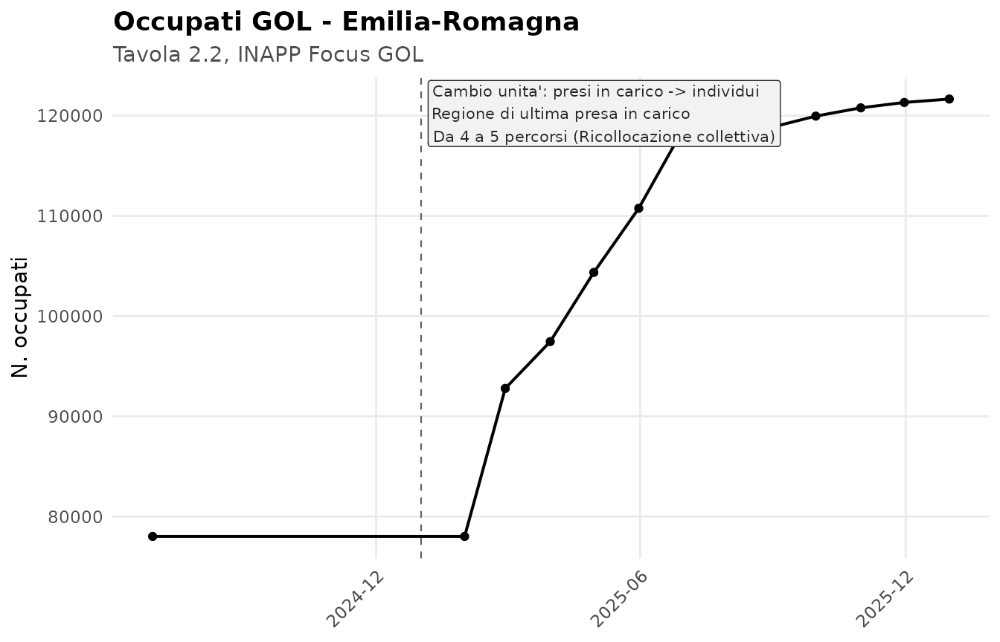
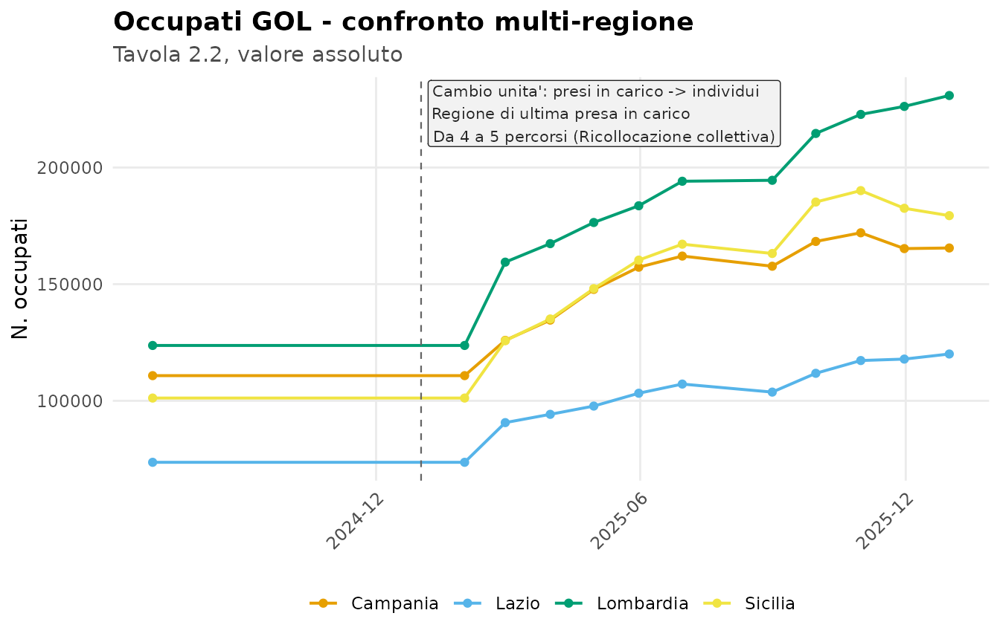
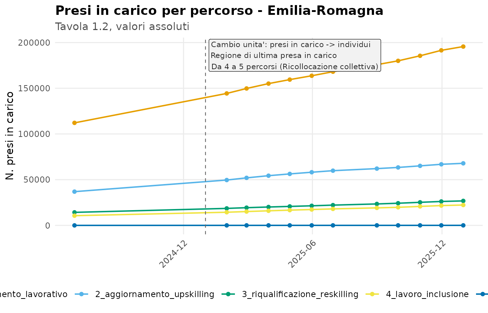
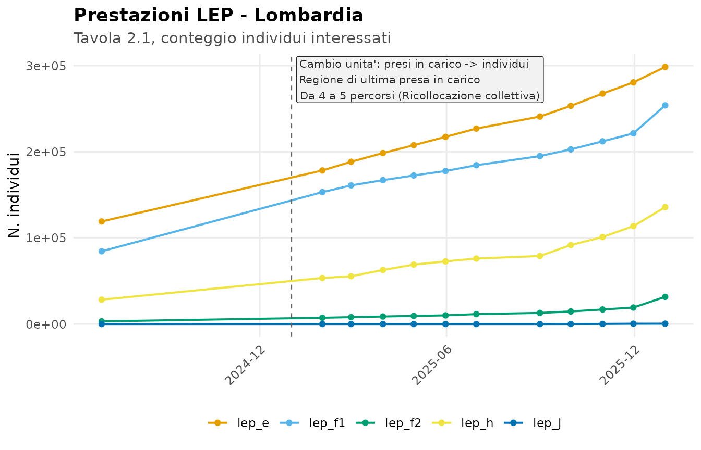
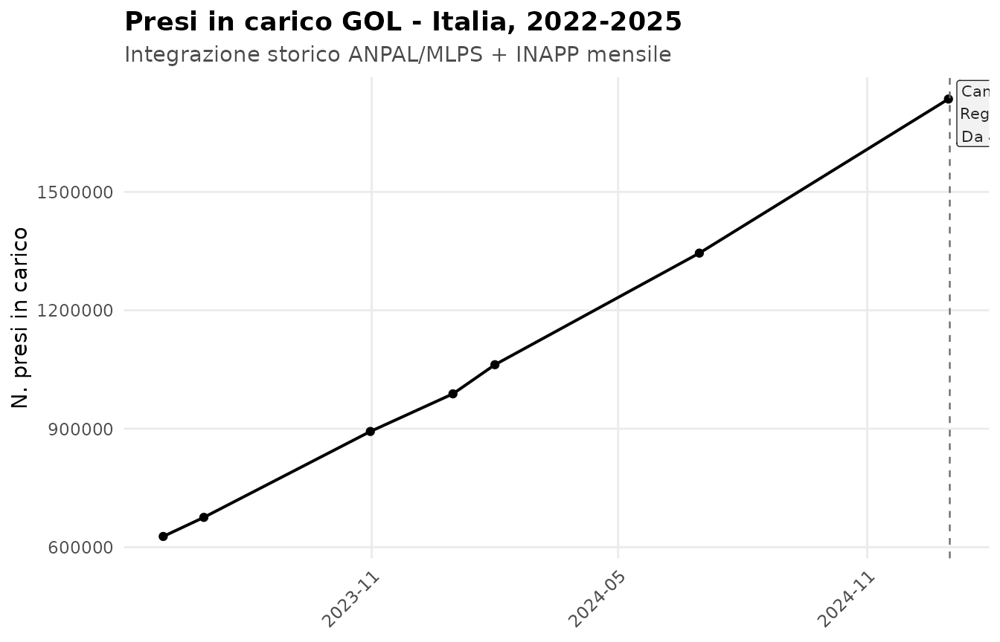
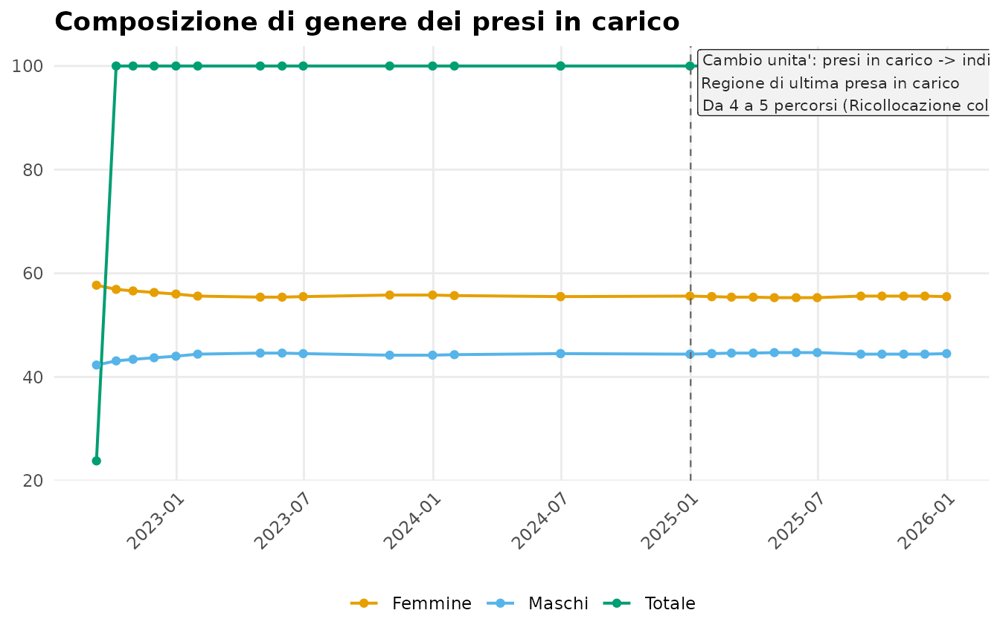
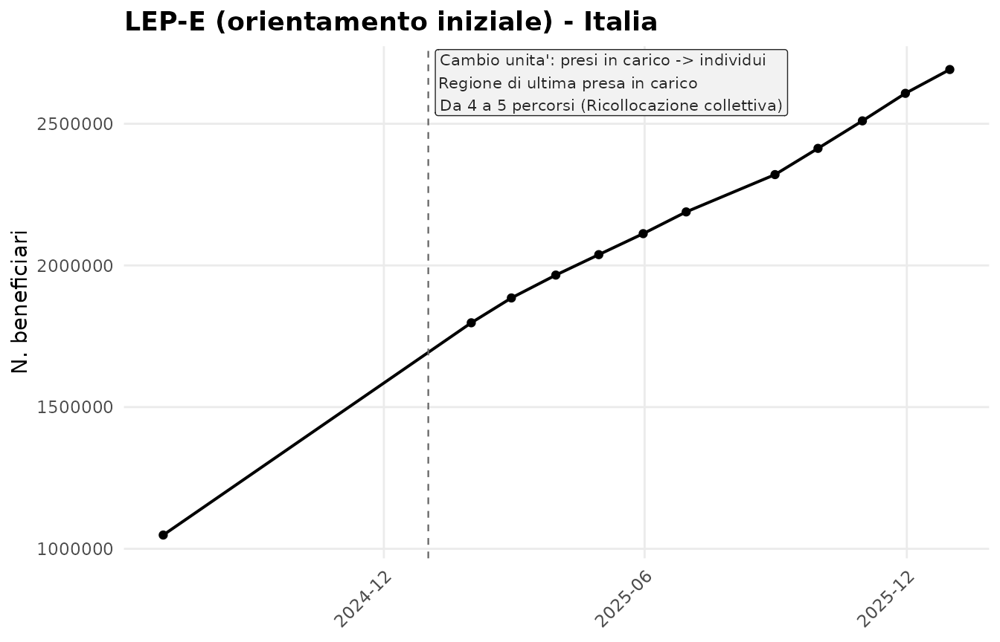
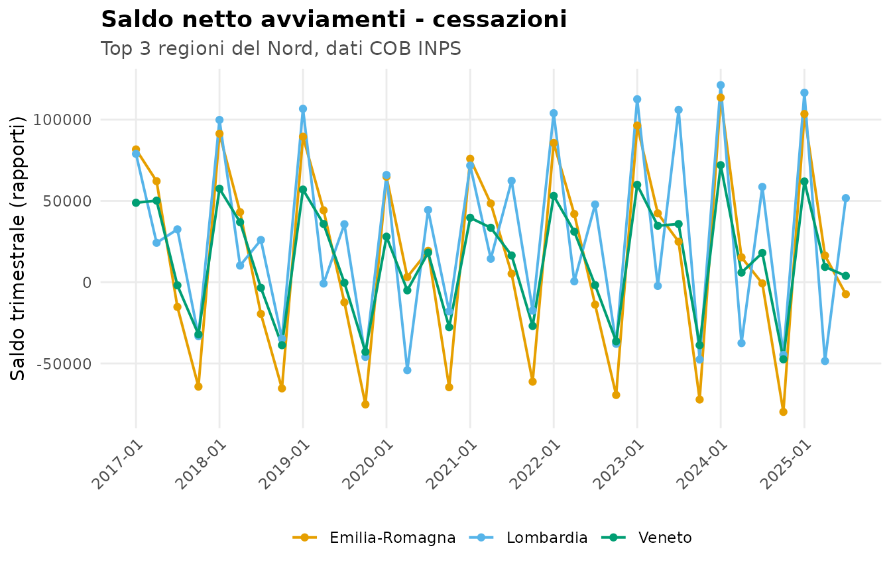
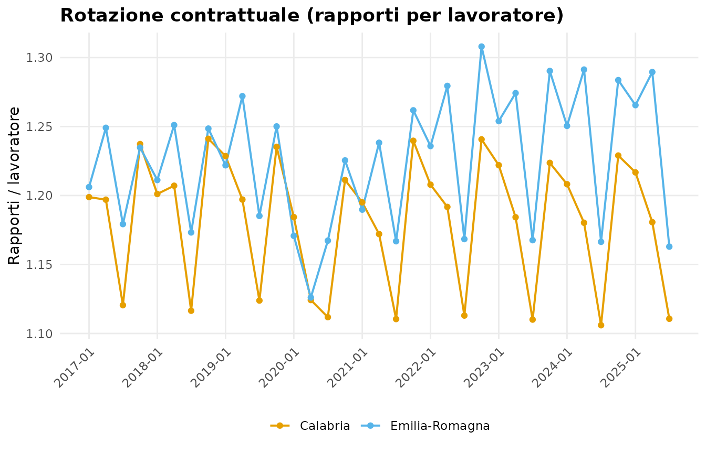

# Merge tra serie GOL e baseline COB

Questa vignette mostra un caso d’uso cross-dataset: combinare le serie
INAPP del Programma GOL con i flussi del mercato del lavoro provenienti
dalle Comunicazioni Obbligatorie (COB) INPS, sfruttando il fatto che
entrambi i dataset usano le stesse 21 etichette regionali canoniche.

``` r

library(golDatasets)
library(data.table)
#> 
#> Attaching package: 'data.table'
#> The following object is masked from 'package:base':
#> 
#>     %notin%
```

## 1. Esiti occupazionali GOL per regione

La tavola 2.2 della serie INAPP riporta gli “occupati” tra i raggiunti
dal programma. Filtriamo i valori assoluti aggregati per regione
(`percorso == ""`) all’ultima data disponibile.

``` r

ultima_data <- max(gol_inapp_mensile$data_riferimento)

occupati <- gol_inapp_mensile[
  tavola == 2.2 &
    data_riferimento == ultima_data &
    dimensione == "regione" &
    percorso == "" &
    variabile == "occupati_totale" &
    etichetta != "Totale",
  .(regione = etichetta, occupati_gol = valore)
]

setorder(occupati, -occupati_gol)
head(occupati, 10)
#>            regione occupati_gol
#>             <char>        <num>
#>  1:      Lombardia       230850
#>  2:        Sicilia       179361
#>  3:       Campania       165501
#>  4:         Puglia       146664
#>  5:         Veneto       143476
#>  6:        Toscana       132382
#>  7: Emilia-Romagna       121658
#>  8:          Lazio       120066
#>  9:       Piemonte       112057
#> 10:       Sardegna        66442
```

## 2. Flusso COB della stessa regione, ultimo anno disponibile

Aggreghiamo i flussi del 2025 (3 trimestri disponibili) per ciascuna
regione, restando sugli avviamenti.

``` r

cob_2025 <- cob_regionale_trimestrale[
  flusso == "avviamenti" & anno == 2025,
  .(avviamenti_2025 = sum(rapporti, na.rm = TRUE),
    lavoratori_2025 = sum(lavoratori, na.rm = TRUE)),
  by = regione
]

head(cob_2025, 5)
#> Key: <regione>
#>           regione avviamenti_2025 lavoratori_2025
#>            <char>           <num>           <num>
#> 1:        Abruzzo          212708          177828
#> 2:     Basilicata          120862           91817
#> 3:       Calabria          275822          236409
#> 4:       Campania          823743          628379
#> 5: Emilia-Romagna          856728          691433
```

## 3. Merge sulla chiave regionale

I due dataset condividono la stessa convenzione di naming: le 21
etichette regionali canoniche. Il merge è quindi diretto.

``` r

panel <- merge(occupati, cob_2025, by = "regione", all = FALSE)

panel[, quota_gol_su_avviamenti := occupati_gol / avviamenti_2025]
setorder(panel, -quota_gol_su_avviamenti)
panel
#>                   regione occupati_gol avviamenti_2025 lavoratori_2025
#>                    <char>        <num>           <num>           <num>
#>  1: Friuli-Venezia Giulia        52880          184203          158344
#>  2:                Umbria        30844          124867          103313
#>  3:               Sicilia       179361          730215          583464
#>  4:              Sardegna        66442          280514          233126
#>  5:              Piemonte       112057          505085          428621
#>  6:               Toscana       132382          625907          512636
#>  7:              Calabria        58311          275822          236409
#>  8:              Campania       165501          823743          628379
#>  9:                Veneto       143476          727404          625449
#> 10:                Marche        47024          247312          205987
#> 11:                Puglia       146664          917030          651392
#> 12:             Lombardia       230850         1517151         1186585
#> 13:               Abruzzo        31286          212708          177828
#> 14:                Molise         5587           38607           32561
#> 15:            Basilicata        17231          120862           91817
#> 16:        Emilia-Romagna       121658          856728          691433
#> 17:         Valle d'Aosta         3579           26492           22933
#> 18:               Liguria        29223          221783          188820
#> 19:           P.A. Trento        13329          134871          118923
#> 20:                 Lazio       120066         1422964          804587
#> 21:          P.A. Bolzano         8764          158050          140296
#>                   regione occupati_gol avviamenti_2025 lavoratori_2025
#>                    <char>        <num>           <num>           <num>
#>     quota_gol_su_avviamenti
#>                       <num>
#>  1:              0.28707459
#>  2:              0.24701482
#>  3:              0.24562766
#>  4:              0.23685805
#>  5:              0.22185771
#>  6:              0.21150427
#>  7:              0.21140808
#>  8:              0.20091339
#>  9:              0.19724390
#> 10:              0.19014039
#> 11:              0.15993370
#> 12:              0.15216020
#> 13:              0.14708427
#> 14:              0.14471469
#> 15:              0.14256756
#> 16:              0.14200306
#> 17:              0.13509739
#> 18:              0.13176393
#> 19:              0.09882777
#> 20:              0.08437740
#> 21:              0.05545081
#>     quota_gol_su_avviamenti
#>                       <num>
```

## 4. Serie temporale per una singola regione

Concatenando le due serie possiamo costruire una visione regionale
dell’andamento. Esempio per l’Emilia-Romagna.

``` r

serie_gol <- gol_inapp_mensile[
  tavola == 2.2 &
    etichetta == "Emilia-Romagna" &
    percorso == "" &
    variabile == "occupati_totale",
  .(data = data_riferimento,
    fonte = "GOL: occupati (INAPP)",
    valore = valore)
]

serie_cob <- cob_regionale_trimestrale[
  regione == "Emilia-Romagna" & flusso == "avviamenti",
  .(data = data_inizio_trimestre,
    fonte = "COB: avviamenti (INPS)",
    valore = rapporti)
]

serie <- rbindlist(list(serie_gol, serie_cob))
setorder(serie, data, fonte)
serie[, .N, by = fonte]
#>                     fonte     N
#>                    <char> <int>
#> 1: COB: avviamenti (INPS)    35
#> 2:  GOL: occupati (INAPP)    12
```

## 5. Visualizzazione con rotture annotate

[`plot_timeline()`](https://gmontaletti.github.io/golDatasets/reference/plot_timeline.md)
produce una timeline con annotazione automatica delle rotture di metodo.
Il dataset `gol_method_ruptures` espone i tre eventi documentati al
passaggio del 2025.

``` r

plot_timeline(
  serie_gol,
  ruptures = gol_method_ruptures,
  title    = "Occupati GOL - Emilia-Romagna",
  subtitle = "Tavola 2.2, INAPP Focus GOL",
  y_label  = "N. occupati"
)
```



### 5.1 Estrazione strutturata: `gol_extract_series()`

Per evitare di scrivere ogni volta i filtri sulla long table, l’helper
[`gol_extract_series()`](https://gmontaletti.github.io/golDatasets/reference/gol_extract_series.md)
produce una serie pronta per
[`plot_timeline()`](https://gmontaletti.github.io/golDatasets/reference/plot_timeline.md)
data la `variabile` (la tavola viene inferita automaticamente).

``` r

serie_multi <- gol_extract_series(
  variabile = "occupati_totale",
  etichetta = c("Lombardia", "Lazio", "Campania", "Sicilia")
)
plot_timeline(
  serie_multi,
  group    = "regione",
  ruptures = gol_method_ruptures,
  title    = "Occupati GOL - confronto multi-regione",
  subtitle = "Tavola 2.2, valore assoluto",
  y_label  = "N. occupati"
)
```



Decomposizione per **percorso GOL**: la tavola 1.2 codifica i 5 percorsi
come colonne `variabile`, ricomponiamo la serie in long con un piccolo
`rbindlist`.

``` r

percorsi_ass <- c("1_reinserimento_lavorativo_ass",
                  "2_aggiornamento_upskilling_ass",
                  "3_riqualificazione_reskilling_ass",
                  "4_lavoro_inclusione_ass",
                  "5_ricollocazione_collettiva_ass")

serie_perc <- rbindlist(lapply(percorsi_ass, function(v) {
  s <- gol_extract_series(variabile = v,
                          etichetta = "Emilia-Romagna",
                          tavola    = 1.2)
  s[, percorso := sub("_ass$", "", v)]
  s[]
}))

plot_timeline(
  serie_perc,
  group    = "percorso",
  ruptures = gol_method_ruptures,
  title    = "Presi in carico per percorso - Emilia-Romagna",
  subtitle = "Tavola 1.2, valori assoluti",
  y_label  = "N. presi in carico"
)
```



Confronto **prestazioni LEP** (tav 2.1) per una singola regione, stesso
pattern di `rbindlist`.

``` r

leps <- c("lep_e", "lep_f1", "lep_f2", "lep_h", "lep_j")
serie_lep <- rbindlist(lapply(leps, function(v) {
  s <- gol_extract_series(variabile = v, etichetta = "Lombardia")
  s[, lep := v]
  s[]
}))

plot_timeline(
  serie_lep,
  group    = "lep",
  ruptures = gol_method_ruptures,
  title    = "Prestazioni LEP - Lombardia",
  subtitle = "Tavola 2.1, conteggio individui interessati",
  y_label  = "N. individui"
)
```



### 5.2 Qualità delle estrazioni storiche

Il dataset `gol_storico_regionale` deriva dall’estrazione automatica di
27 PDF di monitoraggio GOL. Non tutte le combinazioni
`(file, tema, caption_num)` hanno la stessa qualità: la funzione
[`gol_storico_quality()`](https://gmontaletti.github.io/golDatasets/reference/gol_storico_quality.md)
calcola metriche di copertura e completamento e classifica ogni
estrazione in 5 tier di severità.

``` r

q <- gol_storico_quality()
q[, .N, by = severity][order(severity)]
#>      severity     N
#>        <char> <int>
#> 1:         ok    89
#> 2: rescan_low     9
```

Le anomalie residue (tutte non `ok`) sono esposte come dataset
`gol_rescan_recommendations`. La maggior parte sono **file ANPAL
2022-2024 con 19-20 regioni invece di 21**, che si possono recuperare
ri-estraendo direttamente dal PDF.

``` r

gol_rescan_recommendations[, .(file, tema, caption_num, n_anchor, severity)]
#>                                                        file   tema caption_num
#>                                                      <char> <char>      <char>
#> 1: 2022/Nota monitoraggio GOL 2-2022 - Focus n. 13782e9.pdf      B           3
#> 2:   2022/Nota monitoraggio GOL 3-2022 Focus n. 139475c.pdf      B           3
#> 3:  2022/Nota monitoraggio GOL 1-2022 - Focus N 135bdfb.pdf     A1           2
#> 4:  2022/Nota monitoraggio GOL 1-2022 - Focus N 135bdfb.pdf      B           3
#> 5: 2022/Nota monitoraggio GOL 2-2022 - Focus n. 13782e9.pdf     A1           2
#> 6:   2022/Nota monitoraggio GOL 3-2022 Focus n. 139475c.pdf     A1           2
#> 7:     2023/ANPAL_Nota_12-2023_Focus166_dati_31-10-2023.pdf      F         2.1
#> 8:     2023/ANPAL_Nota_14-2023_Focus169_dati_31-12-2023.pdf      F         2.1
#> 9:                        2024/Nota-monitoraggio-1_2024.pdf      F         2.1
#>    n_anchor   severity
#>       <int>     <char>
#> 1:       20 rescan_low
#> 2:       20 rescan_low
#> 3:       20 rescan_low
#> 4:       20 rescan_low
#> 5:       20 rescan_low
#> 6:       20 rescan_low
#> 7:       19 rescan_low
#> 8:       19 rescan_low
#> 9:       19 rescan_low
```

Il caso più grave (INAPP A1/1.2 — 10 file su 11 con extraction fallita
in `dataset_long/`) è già stato risolto in fase di build sostituendo le
righe rotte con la versione decodificata di
`INAPP GOL/csv_long/tab_1_2_long.csv`. La colonna `rescan_severity`
traccia la provenienza di ciascuna riga.

``` r

gol_storico_regionale[, .N, by = rescan_severity]
#>                 rescan_severity     N
#>                          <char> <int>
#> 1:                           ok 18861
#> 2:                   rescan_low  1369
#> 3: replaced_from_inapp_csv_long  2420
```

### 5.3 Storia lunga 2022-2025

I tre dataset `gol_storia_volumi`, `gol_storia_caratteristiche`,
`gol_storia_esiti` integrano lo storico ANPAL/MLPS (cadenza
episodica/semestrale) con la serie mensile INAPP, producendo una visione
completa del Programma GOL dal 2022 alla fine del 2025. Le rotture
metodologiche del 2025 sono annotate via `gol_method_ruptures`.

``` r

serie_pic <- gol_storia_volumi_series(
  variabile = "presi_in_carico_totale",
  regione   = "Totale"
)
plot_timeline(
  serie_pic,
  ruptures = gol_method_ruptures,
  title    = "Presi in carico GOL - Italia, 2022-2025",
  subtitle = "Integrazione storico ANPAL/MLPS + INAPP mensile",
  y_label  = "N. presi in carico"
)
```



Composizione di genere (storica dal 2022, valori percentuali ANPAL):

``` r

serie_genere <- gol_storia_caratteristiche_series(
  caratteristica = "genere",
  regione        = "Totale"
)
plot_timeline(
  serie_genere,
  group    = "modalita",
  ruptures = gol_method_ruptures,
  title    = "Composizione di genere dei presi in carico"
)
```



LEP-E (orientamento iniziale, INAPP mensile):

``` r

serie_lep <- gol_storia_esiti_series(variabile = "lep_e",
                                      regione = "Totale")
plot_timeline(
  serie_lep,
  ruptures = gol_method_ruptures,
  title    = "LEP-E (orientamento iniziale) - Italia",
  y_label  = "N. beneficiari"
)
```



I tre dataset propagano la colonna `confidenza` che permette di filtrare
via `min_confidenza = "high"` per analisi rigorose, escludendo le righe
le cui semantiche derivano da inferenza euristica sul `header_above`.

### 5.4 Plot COB

Per le serie COB (che non hanno rotture metodologiche note) il parametro
`ruptures` rimane `NULL` e si usa una palette CVD-safe (Okabe-Ito) per
il confronto multi-regione.

``` r

ind <- cob_compute_indicators()
serie_saldi <- ind[
  regione %in% c("Emilia-Romagna", "Lombardia", "Veneto"),
  .(data = data_inizio_trimestre,
    valore = saldo_rapporti,
    regione)
]
plot_timeline(
  serie_saldi,
  group       = "regione",
  title       = "Saldo netto avviamenti - cessazioni",
  subtitle    = "Top 3 regioni del Nord, dati COB INPS",
  y_label     = "Saldo trimestrale (rapporti)",
  date_breaks = "1 year"
)
```



## 6. Indicatori derivati COB

[`cob_compute_indicators()`](https://gmontaletti.github.io/golDatasets/reference/cob_compute_indicators.md)
produce un wide-table con i flussi e gli indicatori derivati piu’ usati
per l’analisi del mercato del lavoro regionale.

``` r

ind <- cob_compute_indicators()
str(ind[1])
#> Classes 'data.table' and 'data.frame':   1 obs. of  15 variables:
#>  $ regione              : chr "Abruzzo"
#>  $ anno                 : int 2017
#>  $ trimestre            : int 1
#>  $ data_inizio_trimestre: IDate, format: "2017-01-01"
#>  $ avviamenti_rapporti  : num 48519
#>  $ cessazioni_rapporti  : num 34400
#>  $ avviamenti_lavoratori: num 40644
#>  $ cessazioni_lavoratori: num 27914
#>  $ rotation_avviamenti  : num 1.19
#>  $ rotation_cessazioni  : num 1.23
#>  $ saldo_rapporti       : num 14119
#>  $ saldo_lavoratori     : num 12730
#>  $ yoy_avviamenti       : num NA
#>  $ yoy_cessazioni       : num NA
#>  $ yoy_saldo            : num NA
#>  - attr(*, ".internal.selfref")=<pointer: 0x5600526d9010> 
#>  - attr(*, "sorted")= chr [1:3] "regione" "anno" "trimestre"
```

Estrazione tipica: indice di rotazione (`rapporti / lavoratori`) per gli
avviamenti.

``` r

plot_timeline(
  ind[regione %in% c("Emilia-Romagna", "Calabria"),
      .(data = data_inizio_trimestre, valore = rotation_avviamenti, regione)],
  group       = "regione",
  title       = "Rotazione contrattuale (rapporti per lavoratore)",
  y_label     = "Rapporti / lavoratore",
  date_breaks = "1 year"
)
```



## 7. Rotture di serie da tenere a mente

Prima di costruire indicatori longitudinali, è importante ricordare le
rotture di serie documentate in `dataset_long/README.md`:

- **Cambio unità di osservazione** nel 2025 (presi in carico →
  individui).
- **Cambio regola di assegnazione regionale** nel 2025 (regione di presa
  in carico → regione di ultima presa in carico).
- **Passaggio da 4 a 5 percorsi GOL** con `ricollocazione_collettiva`
  introdotto nel 2025.

Lo storico più lungo è disponibile in `gol_storico_regionale`, ma per i
quattro temi A1, B, F, H il `col_index` non è confrontabile direttamente
pre/post 2025.

## 8. Convenzione regioni

Le 21 etichette canoniche usate da tutti e tre i dataset:

``` r

sort(unique(cob_regionale_trimestrale$regione))
#>  [1] "Abruzzo"               "Basilicata"            "Calabria"             
#>  [4] "Campania"              "Emilia-Romagna"        "Friuli-Venezia Giulia"
#>  [7] "Lazio"                 "Liguria"               "Lombardia"            
#> [10] "Marche"                "Molise"                "P.A. Bolzano"         
#> [13] "P.A. Trento"           "Piemonte"              "Puglia"               
#> [16] "Sardegna"              "Sicilia"               "Toscana"              
#> [19] "Umbria"                "Valle d'Aosta"         "Veneto"
```
